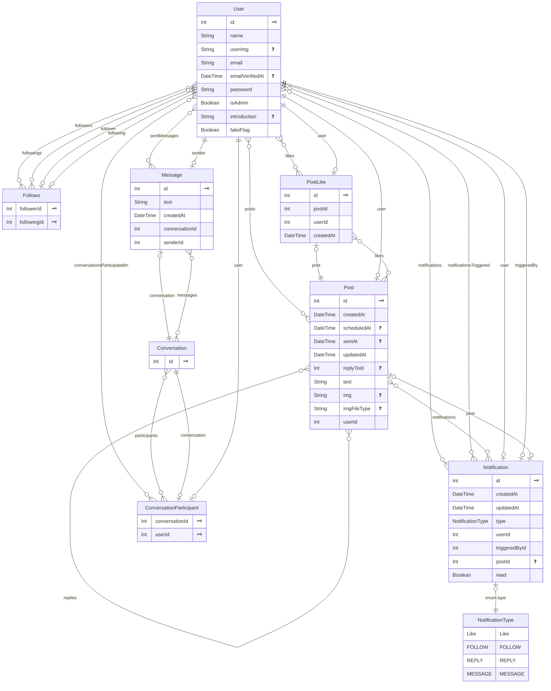

```mermaid
erDiagram

        NotificationType {
            Like Like
FOLLOW FOLLOW
REPLY REPLY
MESSAGE MESSAGE
        }
    
  "User" {
    Int id "🗝️"
    String name 
    String userImg "❓"
    String email 
    DateTime emailVerifiedAt "❓"
    String password 
    Boolean isAdmin 
    String introduction "❓"
    Boolean fakeFlag 
    }
  

  "Follows" {
    Int followerId "🗝️"
    Int followingId "🗝️"
    }
  

  "Post" {
    Int id "🗝️"
    DateTime createdAt 
    DateTime scheduledAt "❓"
    DateTime sentAt "❓"
    DateTime updatedAt 
    Int replyToId "❓"
    String text 
    String img "❓"
    String imgFileType "❓"
    Int userId 
    }
  

  "PostLike" {
    Int id "🗝️"
    Int postId 
    Int userId 
    DateTime createdAt 
    }
  

  "Notification" {
    Int id "🗝️"
    DateTime createdAt 
    DateTime updatedAt 
    NotificationType type 
    Int userId 
    Int triggeredById 
    Int postId "❓"
    Boolean read 
    }
  

  "Conversation" {
    Int id "🗝️"
    }
  

  "ConversationParticipant" {
    Int conversationId "🗝️"
    Int userId "🗝️"
    }
  

  "Message" {
    Int id "🗝️"
    String text 
    DateTime createdAt 
    Int conversationId 
    Int senderId 
    }
  
    "User" o{--}o "PostLike" : "likes"
    "User" o{--}o "Post" : "posts"
    "User" o{--}o "Follows" : "followers"
    "User" o{--}o "Follows" : "followings"
    "User" o{--}o "Notification" : "notifications"
    "User" o{--}o "Notification" : "notificationsTriggered"
    "User" o{--}o "Message" : "sentMessages"
    "User" o{--}o "ConversationParticipant" : "conversationsParticipatedIn"
    "Follows" o|--|| "User" : "follower"
    "Follows" o|--|| "User" : "following"
    "Post" o|--|o "Post" : "post"
    "Post" o{--}o "Post" : "replies"
    "Post" o|--|| "User" : "user"
    "Post" o{--}o "PostLike" : "likes"
    "Post" o{--}o "Notification" : "notifications"
    "PostLike" o|--|| "Post" : "post"
    "PostLike" o|--|| "User" : "user"
    "Notification" o|--|| "NotificationType" : "enum:type"
    "Notification" o|--|| "User" : "user"
    "Notification" o|--|| "User" : "triggeredBy"
    "Notification" o|--|o "Post" : "post"
    "Conversation" o{--}o "Message" : "messages"
    "Conversation" o{--}o "ConversationParticipant" : "participants"
    "ConversationParticipant" o|--|| "Conversation" : "conversation"
    "ConversationParticipant" o|--|| "User" : "user"
    "Message" o|--|| "Conversation" : "conversation"
    "Message" o|--|| "User" : "sender"
```
